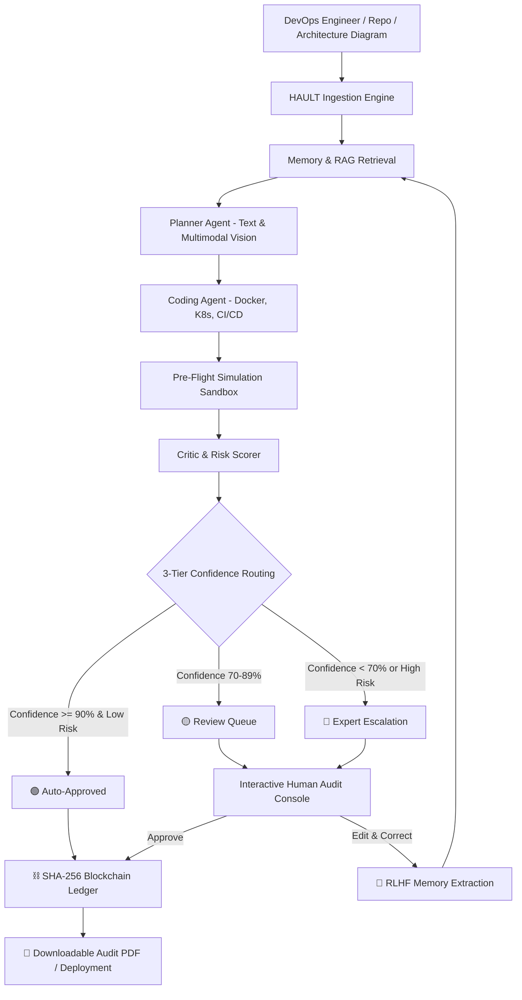

# 🛸 HAULT: Human-in-the-Loop DevOps Command Suite

[](https://python.org)
[](https://streamlit.io)
[](https://aistudio.google.com/)
[](https://www.docker.com/)
[](https://kubernetes.io/)
[](https://github.com/features/actions)
[](https://en.wikipedia.org/wiki/Cryptographic_hash_function)
[](LICENSE)

> **Autonomous AI speed meets real-world human judgement.**  
> HAULT brings enterprise safety, confidence-based escalation, continuous memory learning (RLHF), and an immutable cryptographic audit ledger to AI-driven DevOps automation.

---

## 🌟 Why HAULT?

AI coding assistants can generate Dockerfiles, Kubernetes manifests, and CI/CD pipelines in seconds. But in production engineering, **blind automation is a liability**:
- A single unpinned image tag can introduce security vulnerabilities.
- An unvetted Kubernetes ClusterIP service can break routing.
- An untested GitHub Actions trigger can fail silent builds.

**HAULT (Human-in-the-Loop)** was built to solve this exact dilemma. Rather than treating AI as an unchecked black box, HAULT establishes a collaborative control room where AI agents propose, simulate, and score configurations—while human engineers maintain decisive oversight through automated risk routing.

Whenever an engineer edits or rejects an AI-generated configuration, HAULT **learns why**, extracting preference rules and injecting them into future generations via active memory and RAG (Retrieval-Augmented Generation).

---

## 🚀 Key Capabilities

### 🤖 1. Multi-Agent Orchestration Pipeline
A specialized squad of autonomous agents collaborates to generate deployment-ready assets:
- **Planner Agent**: Analyzes project descriptions and system architecture diagrams (with Gemini multimodal vision) to architect container specifications and port bindings.
- **Coding Agent**: Generates production-grade `Dockerfile`, `kubernetes.yaml`, and `.github/workflows/ci-cd.yml`.
- **Simulation Sandbox**: Executes real-time syntax linting, structural checks, and security validations before human review.
- **Critic & Scorer Agent**: Evaluates completeness, security posture, readability, and calculates a calibrated **Confidence Score (0–100%)** and **Risk Rating**.

### 🚦 2. Intelligent 3-Tier Risk Routing
Every proposed deployment is automatically evaluated and assigned to the right oversight tier:
| Tier | Criteria | Action |
| :--- | :--- | :--- |
| 🟢 **Auto-Approved** | High Confidence (≥90%), Low Risk (≤20%) | Passes directly to production ledger without friction |
| 🟡 **Review Queue** | Moderate Confidence (70–89%) or Medium Risk | Queued for rapid peer review and approval |
| 🔴 **Expert Escalation** | Low Confidence (<70%) or High Risk (>50%) | Escalated directly to Senior DevOps Engineers with flagged warnings |

### ⛓️ 3. Cryptographic Blockchain Audit Ledger
- Built-in immutable SHA-256 blockchain ledger tracks every approval, rejection, and code modification.
- Each block records timestamps, project payload, previous hash, and block hash.
- Real-time cryptographic tamper verification guarantees audit-readiness and enterprise compliance.

### 🧠 4. Continuous Learning via RLHF & RAG Memory
- **Human Preference Extraction**: When an engineer corrects generated YAML or Docker code, HAULT analyzes the diff, infers the underlying operational policy (e.g., *"Always bind non-root user group 10001"*), and saves it.
- **RAG Knowledge Base**: High-rated approved templates are automatically indexed to guide future generations.

### 📄 5. Executive PDF Audit Reports
- One-click export of publication-ready DevOps compliance reports powered by ReportLab.
- Formatted with project summaries, architectural breakdowns, risk matrices, generated configurations, and cryptographic audit stamps.

### 📊 6. DevOps Telemetry & Analytics
- Live observability tracking agent response times, token consumption, estimated LLM costs, hallucination indices, and accuracy metrics.

---

## 🏗️ System Architecture



---

## 📂 Project Structure

```bash
Human-in-the-loop/
│
├── app.py                     # Main Streamlit command center dashboard
├── config.py                  # Environment configuration & Gemini model setup
├── requirement.txt            # Python package dependencies
├── approval.db                # SQLite database (auto-created on first launch)
├── Devops_Report.pdf          # Sample generated DevOps compliance report
├── .env.example               # Template for environment variables
├── .gitignore                 # Standard git ignore patterns
│
├── agents/                    # Multi-agent core engine
│   ├── orchestrator.py        # Pipeline orchestrator, simulation, and local fallback
│   ├── cicd_agent.py          # GitHub Actions workflow generator
│   ├── docker_agent.py        # Dockerfile generator
│   ├── kubernetes_agent.py    # Kubernetes manifests generator
│   ├── github_agent.py        # GitHub repository & README context inspector
│   ├── review_agent.py        # Code quality and security reviewer
│   └── risk_agent.py          # Deployment risk analyzer
│
├── database/                  # Data persistence layer
│   └── db.py                  # SQLite schema, self-healing migrations & mock data
│
├── utils/                     # Auxiliary services
│   ├── blockchain.py          # SHA-256 cryptographic audit ledger & validator
│   └── pdf_generator.py       # Enterprise PDF report generator (ReportLab)
│
└── scratch/                   # Developer test scripts
    ├── test_api.py            # Gemini API connectivity test
    └── test_imports.py        # Internal module and schema validation test
```

---

## ⚡ Quickstart Guide

### Prerequisites
- Python 3.10 or higher
- Git installed on your system
- (Optional) A Google Gemini API Key from [Google AI Studio](https://aistudio.google.com/)

### 1. Clone the Repository
```bash
git clone https://github.com/Nishant052004/Human-in-the-loop.git
cd Human-in-the-loop
```

### 2. Create and Activate Virtual Environment
```bash
# Windows
python -m venv venv
.\venv\Scripts\activate

# macOS / Linux
python3 -m venv venv
source venv/bin/activate
```

### 3. Install Dependencies
```bash
pip install -r requirement.txt
```

### 4. Configure Environment Variables
Create a `.env` file from the provided template:
```bash
cp .env.example .env
```
Open `.env` and add your keys:
```env
# Gemini API Key (Get from https://aistudio.google.com/)
GEMINI_API_KEY=your_gemini_api_key_here

# GitHub Personal Access Token (Optional, for public/private repo analysis)
GITHUB_TOKEN=your_github_token_here
```

> **💡 Resilient Offline Fallback:**  
> If no API key is supplied or API rate limits occur, HAULT automatically engages its **Local Simulation Sandbox Engine**, allowing full feature exploration without an external API!

### 5. Launch the Command Suite
```bash
streamlit run app.py
```
Open your browser at `http://localhost:8501` to access the HAULT Dashboard.

---

## 🖥️ Walkthrough of the Command Center

### 1. 🚀 Agent Console
- Input project descriptions, architecture specs, or repository links.
- Upload architecture diagrams (PNG, JPG) for multimodal visual analysis.
- Trigger the multi-agent pipeline and observe step-by-step progress in real-time.

### 2. 👥 Auditor Approval Queue
- Filter requests by status (**Pending**, **Approved**, **Rejected**).
- Inspect code side-by-side with risk scores, confidence ratings, and critique notes.
- Direct inline editing with instant RLHF preference extraction when edits are submitted.

### 3. 🧠 Memory & RAG Knowledge Base
- View learned team habits and preferences extracted from human corrections.
- Inspect approved reference templates used for RAG prompting.

### 4. 📊 Monitoring & Analytics
- Visual telemetry graphs displaying latency distribution, token usage, and quality trends.

### 5. ⛓️ Cryptographic Audit Ledger
- Real-time blockchain ledger displaying block indices, timestamps, SHA-256 hashes, and previous block linkages.
- Instant "Verify Chain Integrity" button to ensure zero records have been altered.

---

## 🧪 Verification & Testing

To verify that all dependencies, database tables, and utilities are properly configured:
```bash
python scratch/test_imports.py
```

To test Gemini model connectivity:
```bash
python scratch/test_api.py
```

---

## 🛡️ Security & Compliance

- **Zero Hardcoded Secrets**: All API tokens and keys are loaded through environment variables or local ignored `.env` files.
- **Auditable History**: Non-repudiation ensured via SHA-256 cryptographic chaining.
- **Fail-Safe Defaults**: High-risk deployments always default to manual expert human sign-off.

---

## 🤝 Contributing

Contributions, feedback, and feature requests are welcome!
1. Fork the Project
2. Create your Feature Branch (`git checkout -b feature/AmazingFeature`)
3. Commit your Changes (`git commit -m 'feat: Add AmazingFeature'`)
4. Push to the Branch (`git push origin feature/AmazingFeature`)
5. Open a Pull Request

---

## 📄 License

Distributed under the MIT License. See `LICENSE` for more information.

---

<p align="center">
  Built with ❤️ for resilient, trustworthy, human-centered DevOps engineering.
</p>
